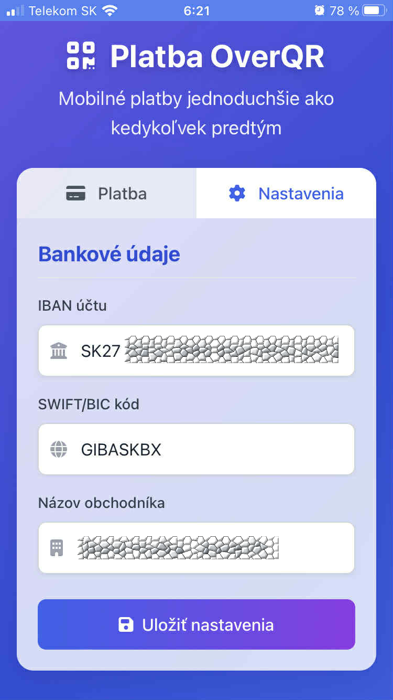
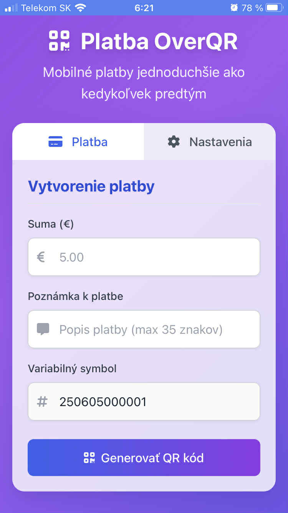
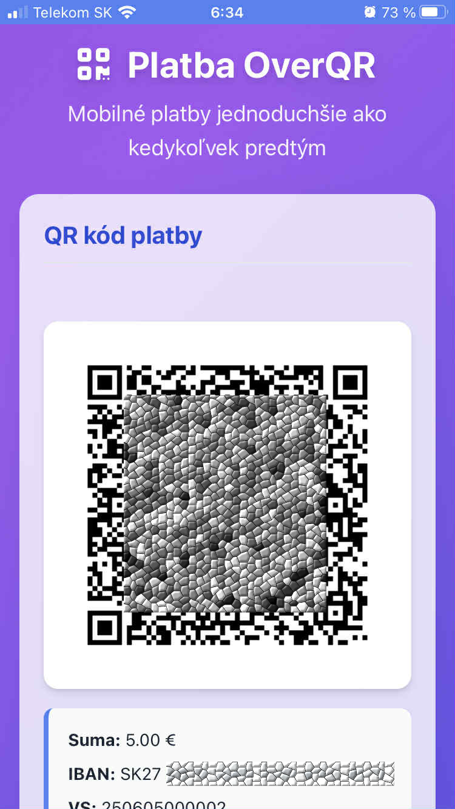

#  Platba OverQR

<div align="center">
  
  
  
  
  
  <br>
  
  <h3>Moderná platforma pre generovanie platobných QR kódov vo formáte PayBySquare</h3>

  <p>Vytvorte QR kód pre bankové platby na Slovensku jednoducho a rýchlo, bez nutnosti inštalácie aplikácie</p>

  [Funkcie](#funkcie) • [Inštalácia](#inštalácia) • [Ako používať](#ako-používať) • [Technológie](#technológie)

  <p align="center">
    
    
    
  </p>
  
  <p align="center"><em>Platba OverQR na iOS: formulár pre rýchle zadanie platby, intuitívne nastavenia účtu a čistý QR kód pre okamžité skenovanie</em></p>
  
  <p align="center">
    <strong>Zameriava sa na jednoduchosť, rýchlosť a elegantný dizajn - od sumy k platobnému QR kódu za pár sekúnd</strong>
  </p>

</div>

## 📝 O projekte

**Platba OverQR** je moderná PWA aplikácia pre jednoduché a rýchle generovanie QR kódov pre bankový prevod vo formáte PayBySquare či Bysquare. Ako môžete vidieť na obrázkoch vyššie, aplikácia poskytuje jednoduché, ľahko ovládateľné rozhranie s tromi hlavnými obrazovkami:

1. **Formulár platby** - rýchle zadanie sumy, poznámky a variabilného symbolu
2. **Nastavenia účtu** - jednoduché zadanie IBAN, BIC kódu a údajov príjemcu
3. **QR kód** - čisto zobrazený, ľahko skenateľný QR kód s detailami platby

Vygenerovaný QR kód môžete naskenovať mobilnou aplikáciou vašej banky a okamžite vykonať platbu bez nutnosti manuálneho zadávania údajov. Aplikácia je optimalizovaná pre mobilné zariadenia s dôrazom na jednoduchú používateľskosť aj na menších obrazovkách.

### 🌟 Prečo Platba OverQR?

- **Moderný mobilný dizajn** - čisté, elegantné rozhranie optimalizované pre používanie na iPhone a Android zariadení
- **Rýchlosť platby** - od zadávania sumy po QR kód v niekoľkých sekundách
- **PWA technológia** - funguje aj offline a môžete si ju nainštalovať ako natívnu aplikáciu na domovskú obrazovku
- **Príjemné UI** - tmavý stavový riadok, grafénové karty a modré/fialové gradient pozadie
- **Maximálna bezpečnosť** - všetky údaje zostávajú iba vo vašom zariadení
- **Bez registrácie** - okamžité použitie bez vytvárania účtov

## ✨ Funkcie

### 💳 Platobné údaje
- Zadanie čiastky platby s automatickým formátovaním
- Variabilný symbol s automatickým generovaním (denné poradové číslo)
- Poznámka k platbe pre príjemcu
- Uloženie IBAN a ďalších nastavení do lokálneho úložiska

### 🔄 Intuitívny workflow
- Prepínanie medzi formulárom platby a zobrazeným QR kódom
- Kliknuteľný QR kód pre rýchly návrat k formuláru
- Automatické mazanie údajov pre vytvorenie novej platby

### 📱 Progressive Web App
- Inštalácia na mobilné zariadenie aj desktop bez návštevy app store
- Offline funkcionalita vďaka service worker-u
- Optimalizované ikony pre všetky platformy a zariadenia

## 🚀 Inštalácia

### Použitie ako webovú stránku
1. Navštívte [https://platba.leqr.sk](https://platba.leqr.sk) v ľubovoľnom modernom prehliadači
2. Začnite okamžite vytvárať platobné QR kódy

### Inštalácia ako PWA na mobilnom zariadení

#### Android
1. Navštívte [https://platba.leqr.sk](https://platba.leqr.sk) v prehliadači Chrome
2. Kliknite na menu (tri bodky) v pravom hornom rohu
3. Vyberte "Pridať na domovskú obrazovku"
4. Potvrďte inštaláciu

#### iOS
1. Navštívte [https://platba.leqr.sk](https://platba.leqr.sk) v prehliadači Safari
2. Kliknite na ikonu zdieľania (štvorec so šípkou nahor)
3. Vyberte "Pridať na domovskú obrazovku"
4. Potvrďte inštaláciu kliknutím na "Pridať"

### Inštalácia ako PWA na desktop
1. Navštívte [https://platba.leqr.sk](https://platba.leqr.sk) v prehliadači Chrome alebo Edge
2. Kliknite na ikonu inštalácie (⊕) v pravej časti adresného riadku
3. Potvrďte inštaláciu kliknutím na "Inštalovať"

## 🔧 Lokálny vývoj

### Požiadavky
- Ľubovoľný webový server (napr. Apache, Nginx, alebo VS Code Live Server)
- Pre generovanie ikon: [ImageMagick](https://imagemagick.org/)

### Inštalácia pre vývojárov
```bash
# Klonovanie repozitára
git clone https://github.com/Santa77/platba.overqr.sk.git
cd platba.overqr.sk

# Lokálne spustenie (príklad s python)
python -m http.server 8080
```

## 📑 Ako používať

### Vytvorenie QR kódu platby
1. Zadajte sumu platby v eurách
2. Voliteľne: zadajte poznámku pre príjemcu
3. Variabilný symbol sa vygeneruje automaticky, alebo si zadajte vlastný
4. Kliknite na tlačidlo "Generovať QR kód"
5. Zobrazí sa QR kód, ktorý môžete naskenovať bankovou aplikáciou

### Ďalšie platby
1. Kliknite na zobrazený QR kód
2. Formulár sa obnoví a vymaže predchádzajúce údaje
3. Zadajte nové údaje pre ďalšiu platbu

## 💻 Technológie

- **Frontend**: Vanilla JavaScript, HTML5, CSS3
- **Styling**: Tailwind CSS
- **QR kód**: qrcode-generator + záloha cez Google Chart API
- **PWA**: Service Worker API, Web App Manifest
- **Ukladanie dát**: localStorage API
- **Ikony**: Generované pomocou ImageMagick zo SVG

```
📂 Štruktúra projektu
├── 📄 index.html              # Hlavný HTML súbor
├── 📄 manifest.json           # PWA manifest
├── 📄 sw.js                   # Service Worker pre offline funkcionalitu
├── 📄 version.json            # Informácie o verzii aplikácie
├── 📄 update-version-v2.ps1   # PowerShell skript pre aktualizáciu verzie
├── 📄 logo.svg                # Zdrojové logo
├── 📄 favicon.ico             # Favicon pre prehliadače
├── 📄 apple-touch-icon.png    # Ikona pre iOS zariadenia
├── 📄 tailwindcss.3.4.16.js   # Tailwind CSS
├── 📂 icons/                  # PWA ikony v rôznych veľkostiach
└── 📂 images/                 # obrázky pre README.md

```

## 🔄 Aktualizácia verzie aplikácie

Aplikácia používa číslo verzie uvedené v rôznych súboroch:

- **version.json**: Hlavný zdroj pravdy pre verziu aplikácie
- **sw.js**: Konštanta APP_VERSION
- **manifest.json**: Verzia aplikácie a query parametre v URL
- **index.html**: Query parametre pre manifest a service worker, a JavaScript konštanta APP_VERSION

Pre aktualizáciu verzie vo všetkých súboroch naraz môžete použiť pripravený PowerShell skript:

```powershell
# Aktualizácia na novú verziu (napr. 1.0.7)
.\update-version.ps1 -NewVersion "1.0.7"
```

Skript automaticky:
1. Vytvorí zálohu aktuálnych súborov pred zmenou
2. Aktualizuje všetky výskyty verzie vo všetkých súboroch
3. Aktualizuje dátum vydania v version.json
4. Navrhne príkazy pre commit, vytvorenie tagu a push zmien

Po spustení skriptu je potrebné zmeny commitnúť, vytvoriť tag a pushnúť do repozitára:

```bash
# Po úspešnej aktualizácii verzie
git add version.json sw.js manifest.json index.html
git commit -m "Aktualizácia verzie na X.Y.Z"
git tag -a vX.Y.Z -m "Verzia X.Y.Z"
git push
git push --tags
```

## 🤝 Prispenie k projektu

Príspevky sú vítané! Ak chcete prispieť k projektu:

1. Forkujte repozitár
2. Vytvorte novú vetvu (`git checkout -b feature/amazing-feature`)
3. Commitnite zmeny (`git commit -am 'Add some amazing feature'`)
4. Pushnite do vetvy (`git push origin feature/amazing-feature`)
5. Otvorte Pull Request

## 🔒 Bezpečnosť a súkromie

- Všetky údaje sú spracovávané lokálne vo vašom zariadení
- Žiadne údaje nie sú odosielané na externé servery
- Nastavenia sú uložené len vo vašom prehliadači (localStorage)
- Aplikácia funguje aj v režime offline

## 📊 Telemetria

Aplikácia využíva Google Tag Manager pre anonymné zbieranie údajov o používaní, čo nám pomáha lepšie porozumieť, ako užívatelia pracujú s aplikáciou a umožňuje nám zlepšovať používateľský zážitok bez zbierania osobných údajov. Podrobný zoznam sledovaných udalostí nájdete v [GTM.md](GTM.md).

## ✍️ Autor

Vytvorené s ❤️ na Slovensku. Copyright © 2025 by Slavoj SANTA Hruška.
