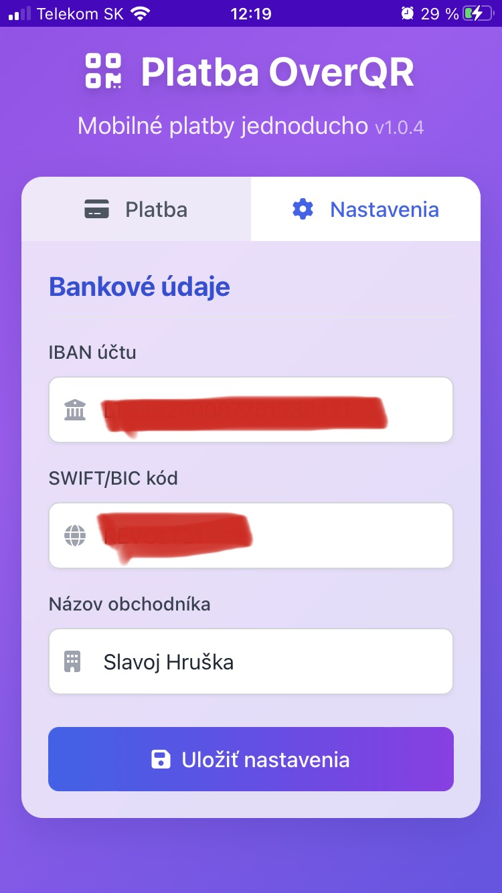
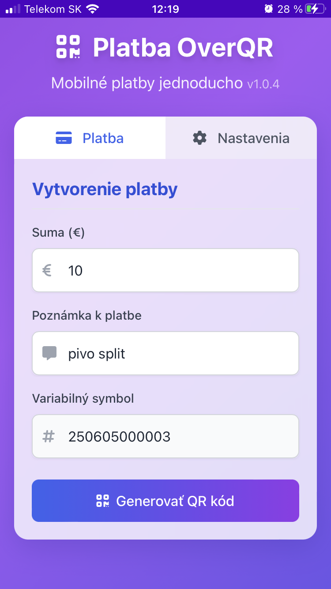
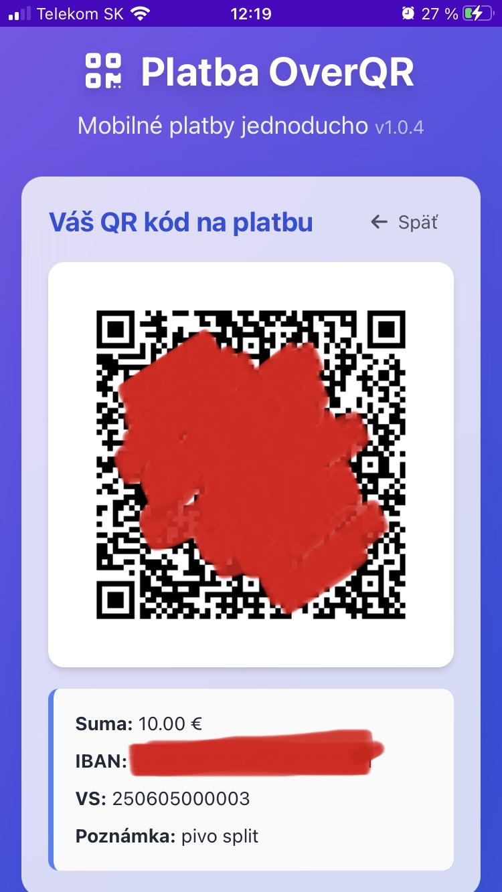

#  Platba LeQR.SK

  
  
  
  
  
   
  
  <h3>Moderná platforma pre generovanie platobných QR kódov vo formáte PayBySquare</h3>

  
Vytvorte QR kód pre bankové platby na Slovensku jednoducho a rýchlo, bez nutnosti inštalácie aplikácie

  
  

    
    
    
  

**Platba LeQR.SK** je moderná platforma pre generovanie platobných QR kódov vo formáte PayBySquare pre bankové platby na Slovensku. Tento projekt je rozdelený na dve hlavné časti:

## Štruktúra projektu

### Frontend (fg/)

Frontend časť aplikácie implementovaná ako moderná PWA (Progressive Web Application) s nasledujúcimi funkciami:

#### 💳 Platobné údaje
- Zadanie čiastky platby s automatickým formátovaním
- Variabilný symbol s automatickým generovaním (denné poradové číslo)
- Poznámka k platbe pre príjemcu
- Uloženie IBAN a ďalších nastavení do lokálneho úložiska

#### 🔄 Intuitívny workflow
- Prepínanie medzi formulárom platby a zobrazeným QR kódom
- Kliknuteľný QR kód pre rýchly návrat k formuláru
- Automatické mazanie údajov pre vytvorenie novej platby

#### 📱 Progressive Web App výhody
- Inštalácia na mobilné zariadenie aj desktop bez návštevy app store
- Offline funkcionalita vďaka service worker-u
- Optimalizované ikony pre všetky platformy a zariadenia

Podrobnejšiu dokumentáciu a informácie o frontende nájdete v [fg/README.md](fg/README.md).

### Backend (bg/)

Backend časť systému (pripravovaná). Backend bude zodpovedný za:
- Správu používateľských účtov a autentifikáciu
- Perzistentné ukladanie dát
- API pre frontend aplikáciu
- Analýzu a reporting

## Vývojové prostredie

### Požiadavky
- Frontend: Moderný webový prehliadač
- Backend: Viac informácií bude dostupných po implementácii

### Inštalácia a spustenie
Pokyny pre inštaláciu a spustenie frontendovej časti nájdete v [fg/README.md](fg/README.md).

## Prispievanie k projektu

Príspevky sú vítané! Pre viac informácií o tom, ako môžete prispieť, kontaktujte správcov projektu.

## Licencia

Tento projekt podlieha licenčným podmienkam vlastníka. Všetky práva vyhradené.
